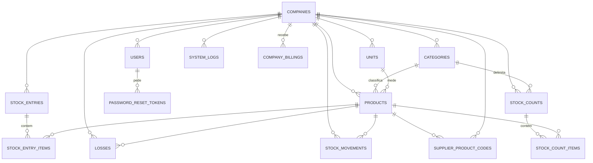

# Modelo de dados

PostgreSQL + [Drizzle ORM](https://orm.drizzle.team/). Schema em `apps/api/src/db/schema/`, um arquivo por tabela, agregado em `schema/index.ts` junto com as `relations`. Migrations geradas por `drizzle-kit` em `apps/api/src/db/migrations/`.

Cada migration SQL, seu snapshot em `migrations/meta/` e o `_journal.json` fazem parte do histórico versionado e
devem ser enviados juntos ao repositório. O histórico de desenvolvimento foi consolidado na migration inicial
`0000`, validada contra um banco vazio antes do primeiro lançamento. Depois da entrada em produção, migrations
aplicadas nunca devem ser apagadas, renomeadas ou reescritas; toda mudança passa a ser incremental.

## Convenções usadas em (quase) toda tabela

- **`companyId` obrigatório** (`uuid` com FK para `companies.id`) — é o que garante o isolamento entre empresas-cliente (ver [decisões arquiteturais](./decisoes-arquiteturais.md)). Toda query de toda tabela de negócio filtra por esse campo, e desde a migration `0006` o próprio banco recusa o que passa do escopo, por política de RLS.
- **Soft delete** via `deletedAt` (timestamp nulável) — nada é apagado de fato, exceto os poucos casos explicitamente documentados. Helper `timestamps` em `columns.ts` (`createdAt`, `updatedAt`, `deletedAt`).
- **Auditoria** via `createdBy`/`updatedBy` (`uuid`, sem FK — ver nota nas decisões arquiteturais sobre impersonação; a única exceção é `company_billings`, que declara a FK para `users`). Helper `auditBy` em `columns.ts`.
- Exceções às duas convenções acima: `companies` (é a raiz, não tem `companyId`), `stock_entry_items`, `stock_count_items` e `stock_movements` (não têm `auditBy` completo: `stock_movements` só tem `createdBy`, e `stock_count_items` só `countedBy`).

## Diagrama

## Tabelas

### `companies`
Raiz do multiempresa — cada linha é um cliente (frutaria/hortifrúti) contratante, exceto a linha especial `"Plataforma"` (ver decisões arquiteturais).

| Coluna | Tipo | Observação |
|---|---|---|
| `id` | uuid | PK |
| `name`, `legalName` | text | nome fantasia e razão social; os registros anteriores à migration podem ter `legalName` nulo. Os dois são **únicos entre empresas não excluídas** |
| `document` | text | CNPJ normalizado, sem pontuação e em maiúsculas (14 posições, as 12 primeiras podendo ser letra no modelo alfanumérico), validado na API e único entre empresas não excluídas |
| `stateRegistration` | text | inscrição estadual opcional; única entre empresas não excluídas **apenas quando contém algum dígito**, porque "Isento" é a ausência de inscrição e se repete |
| `contactName`, `contactEmail`, `phone` | text | responsável e canais de contato; telefone é persistido apenas com dígitos. O e-mail é único entre empresas não excluídas; nome e telefone **podem repetir**, porque o mesmo dono com duas lojas usa o mesmo contato |
| `postalCode`, `street`, `addressNumber` | text | CEP normalizado, logradouro e número |
| `complement`, `district`, `city`, `state` | text | complemento opcional, bairro, cidade e UF (sigla de duas letras, validada contra a lista das 27) |
| `active` | boolean | default `true` — `false` = empresa suspensa, bloqueia login e requisições de todos os usuários dela sem alterar `users.active` |
| `planId` | uuid | FK para `plans`, nulo nas empresas cadastradas pelo `super_admin` antes da assinatura existir |
| `subscriptionStatus` | subscription_status | default `ativa`; `teste` só em quem se cadastrou sozinho |
| `trialEndsOn` | date | último dia do teste, inclusive. `date` e não timestamp: a contagem é de dias corridos |
| `privacyAcceptedAt` | timestamp | quando a pessoa marcou o aceite do aviso de privacidade no cadastro público; nulo nas empresas cadastradas pela plataforma, onde o aceite acontece na assinatura do contrato |
| `stripeCustomerId`, `stripeSubscriptionId` | text | reservados para a integração de pagamento, ainda não preenchidos |
| `createdAt`/`updatedAt`/`deletedAt` | timestamp | |

Os cinco índices únicos (`document`, `name`, `legalName`, `stateRegistration`, `contactEmail`) são
parciais em `deleted_at is null` e comparam por `lower(trim(...))`: excluir uma empresa devolve os
valores para uso. Endereço, telefone e nome do contato não têm índice único, por decisão registrada em
[decisões arquiteturais](./decisoes-arquiteturais.md).

Os campos cadastrais novos são nuláveis no banco para que empresas criadas antes da migration continuem legíveis. A API exige os dados essenciais ao criar uma empresa nova; editar um registro legado pela tela também solicita sua regularização. CNPJ, telefone e CEP são armazenados sem máscara, que é responsabilidade da interface.

### `plans`

Lista de preços da plataforma. **Não tem coluna de empresa**, e é a única tabela nessa situação junto com a linha
especial da plataforma: ela é lida na tela de cadastro, por quem ainda não tem empresa nenhuma.

| Coluna | Tipo | Observação |
|---|---|---|
| `id` | uuid | PK |
| `name` | text | nome do plano exibido na escolha |
| `description` | text | uma linha sobre o que está incluso, opcional |
| `monthlyAmount` | numeric(12,2) | mensalidade cobrada depois do teste |
| `trialDays` | integer | duração do teste grátis, contada em dias corridos |
| `stripePriceId` | text | reservado para a integração de pagamento |
| `active` | boolean | default `true`; plano inativo some da tela de cadastro |
| `createdAt`/`updatedAt`/`deletedAt` | timestamp | |

O preço mora no banco, e não em constante no código, para mudá-lo não exigir publicação de versão: trocar o valor é
um `UPDATE` nesta tabela. A migration `0011` semeia um plano único.

As políticas de RLS desta tabela são **duas**, e a divisão é o ponto: `plans_leitura` libera o `SELECT` em qualquer
escopo, porque preço é público e a tabela não guarda dado de cliente; `plans_escrita_plataforma` mantém
`INSERT`/`UPDATE`/`DELETE` presos ao escopo de plataforma. Numa política única, o `USING (true)` necessário para a
leitura valeria também para o `UPDATE`, e qualquer empresa autenticada poderia reescrever o próprio preço.

### `company_billings`

Controle administrativo manual das mensalidades das empresas-cliente. Não representa cobrança bancária nem executa
pagamentos: o `super_admin` registra o que foi combinado e marca o recebimento depois de confirmar o pagamento por
fora do sistema.

| Coluna | Tipo | Observação |
|---|---|---|
| `id` | uuid | PK |
| `companyId` | uuid | FK `companies.id`; cliente ao qual a mensalidade pertence |
| `referenceMonth` | date | competência persistida como o primeiro dia do mês |
| `dueDate` | date | vencimento acordado |
| `amount` | numeric(12,2) | valor previsto da mensalidade |
| `paidAmount`, `paidAt` | numeric(12,2)/date | ambos nulos enquanto pendente e ambos preenchidos quando pago |
| `notes` | text | observações administrativas opcionais |
| `createdBy`, `updatedBy` | uuid | FKs opcionais para o usuário da plataforma responsável |
| timestamps | | datas de criação e atualização (`deleted_at` vem do bloco compartilhado e não é usado aqui) |

Existe no máximo uma cobrança por empresa e competência. O status não é persistido: a API deriva `pago` quando há
data de pagamento, `atrasado` quando o vencimento já passou e `pendente` nos demais casos — sempre no `select`, para
a badge da tela e o filtro por status nunca discordarem. Excluir uma cobrança apaga a linha (ver
[fluxos de negócio](./fluxos-de-negocio.md#controle-manual-de-cobranças)).

### `users`
| Coluna | Tipo | Observação |
|---|---|---|
| `id` | uuid | PK |
| `companyId` | uuid | FK `companies.id`, obrigatório |
| `name`, `email`, `passwordHash` | text | `email` é **único globalmente** (não escopado por empresa), sempre gravado em minúsculas |
| `role` | enum `user_role` | `admin` \| `gerente` \| `operador` \| `super_admin` |
| `active` | boolean | default `true` — decisão individual do admin; **não** é sobrescrito por suspensão de empresa |
| `passwordChangedAt` | timestamptz | nulável. Token emitido antes deste instante é recusado em toda rota autenticada. Nulo = senha nunca trocada desde a migration `0009`, e aí não há o que comparar |
| `createdAt`/`updatedAt`/`deletedAt`, `createdBy`/`updatedBy` | | |

O e-mail é único **globalmente** porque o login recebe só e-mail e senha, sem escolher empresa: dois usuários com o mesmo e-mail em empresas diferentes deixariam a sessão ambígua.

A unicidade vem do índice parcial `users_email_active_unique`, sobre `lower(email)` e restrito a `deleted_at is null`. As duas características resolvem problemas distintos:

- **`lower(email)`** — a restrição anterior (`users_email_unique`, sensível à caixa) permitia `Maria@Loja.com` e `maria@loja.com` convivendo no banco, enquanto a checagem da aplicação já comparava em minúsculas; duas requisições simultâneas variando só a caixa passavam as duas. Pior: o login procura pelo e-mail exato, então quem fosse cadastrado com maiúscula não conseguia entrar digitando minúsculas — e o teclado do celular põe maiúscula na primeira letra sozinho. Hoje o `emailSchema` (`shared/schemas/email.schema.ts`) normaliza na borda de toda rota que aceita e-mail, e o `seedPlatform.ts` faz o mesmo por gravar direto no banco.
- **`deleted_at is null`** — sem o filtro, o e-mail de um usuário excluído ficava reservado para sempre, e recontratar a mesma pessoa respondia "já existe um usuário com esse e-mail" apontando para alguém invisível em toda tela. É o mesmo padrão parcial que produtos, categorias e unidades já usavam; `assertUniqueUserEmail` aplica a mesma regra na checagem amigável.

O bloqueio de uma empresa suspensa vem de `companies.active`, verificado no login e em toda requisição autenticada — `users.active` não espelha esse valor, para que reativar a empresa não devolva acesso a quem foi desativado à mão.

### `password_reset_tokens`
| Coluna | Tipo | Observação |
|---|---|---|
| `id` | uuid | PK |
| `companyId` | uuid | FK `companies.id`. Não é usado para achar o token; existe para a linha caber na política de RLS e sair no apagamento definitivo da empresa |
| `userId` | uuid | FK `users.id`, **`on delete cascade`** |
| `tokenHash` | varchar(64) | SHA-256 do token, em hexadecimal. Único |
| `expiresAt` | timestamptz | 1 hora por padrão (`PASSWORD_RESET_TTL_MINUTES`) |
| `usedAt` | timestamptz | nulável. Preenchido torna o link inútil |
| `createdAt` | timestamptz | base da carência entre dois pedidos (`PASSWORD_RESET_COOLDOWN_MINUTES`) |

**O token em claro nunca é gravado.** A coluna guarda o SHA-256 dele, então um dump ou um backup não
dá a ninguém o poder de redefinir senha. Não é bcrypt porque a busca é por igualdade exata e bcrypt
não indexa; com 256 bits de aleatoriedade no token, não existe dicionário que ataque o resumo.

**`on delete cascade` é a única exceção ao padrão do schema**, que em todo o resto usa `restrict` ou
`set null` para preservar histórico. Aqui é o contrário de propósito: o pedido é rastro de um
processo, não registro de negócio, e não deve sobreviver à conta que o originou.

Usar um link marca `usedAt` em **todos** os pedidos em aberto daquele usuário, não só no usado: quem
clicou duas vezes em "esqueci minha senha" não pode ficar com um link vivo sobrando na caixa de
entrada. A retenção apaga a linha 7 dias depois do vencimento (`PASSWORD_RESET_KEEP_DAYS`).

### `categories`
Classificação de produtos (ex: Frutas, Verduras). `id`, `companyId`, `name`, `description?`, `targetMargin?`, `active`, timestamps, auditBy.

`targetMargin` é numeric(5,2), com o mesmo `CHECK` de `products`, e serve de padrão do grupo: todo produto da categoria sem margem própria usa a dela. Ver [decisoes-arquiteturais.md](./decisoes-arquiteturais.md#margem-alvo-em-dois-níveis-e-sempre-sobre-a-venda).

### `units`
Unidade de medida (ex: kg, un, dz). `id`, `companyId`, `name`, `abbreviation`, `active`, timestamps, auditBy.

`active` (padrão `true`, migration `0008`) é o jeito de aposentar um cadastro em uso: inativo continua
valendo para os produtos que já apontam para ele e sai das opções de produto novo. Exclusão de categoria
ou unidade em uso é recusada com `409` (`assertNotUsedByProducts`).

### `products`
| Coluna | Tipo | Observação |
|---|---|---|
| `id` | uuid | PK |
| `companyId` | uuid | FK, obrigatório |
| `categoryId` | uuid | FK `categories.id`, obrigatório |
| `unitId` | uuid | FK `units.id`, obrigatório |
| `name` | text | único por empresa |
| `sku`, `barcode` | text | opcionais, `sku` único por empresa quando informado; campo em branco é gravado como `null`, nunca `''` (o índice único parcial só ignora nulos) |
| `costPrice`, `salePrice` | numeric(12,2) | opcionais, podem ser limpos de volta para `null` pela edição |
| `targetMargin` | numeric(5,2) | opcional, percentual **sobre o preço de venda**. `CHECK` entre 0 e 99,99: 100 zeraria o divisor do preço sugerido. Nulo significa herdar a margem da categoria, não "sem margem" |
| `minStock` | numeric(12,3) | default `0`, validado como não negativo — limite do alerta de "estoque baixo", usado pelo filtro da tela de estoque, pelo painel e pelo sino do cabeçalho. Com o default, `currentStock <= minStock` equivale a "zerado": o alerta só avisa **antes** de acabar depois que o cliente preenche o mínimo |
| `currentStock` | numeric(12,3) | default `0` — atualizado pelos fluxos de entrada, perda e ajuste manual; nunca editado direto no cadastro do produto |
| `active` | boolean | default `true` |
| timestamps, auditBy | | |

`currentMargin`, `effectiveTargetMargin`, `targetMarginInherited` e `suggestedPrice` **não são colunas**: a API calcula os quatro a cada consulta de produto, a partir do custo, do preço de venda e da margem alvo que valer. Guardá-los deixaria o preço sugerido velho no instante em que alguém mexesse no custo.

Os alertas do sino não têm tabela: eles são derivados de `products` e `losses` a cada consulta, sem estado de "lido". Ver [decisoes-arquiteturais.md](./decisoes-arquiteturais.md#o-sino-de-alertas-é-estado-atual-não-caixa-de-entrada).

`categoryId`/`unitId` são validados na criação/edição do produto para garantir que pertencem à mesma empresa e que não estão inativos (`assertCategoryAndUnitUsable`, em `products.service.ts`). Produto que já usa um cadastro inativo continua editável: a validação só recusa quando o id muda.

### `stock_entries` + `stock_entry_items`
Entrada de mercadoria (cabeçalho + itens), ver [fluxo de entrada](./fluxos-de-negocio.md#entrada-de-mercadoria).

- `stock_entries`: `id`, `companyId`, `supplierName?` (texto livre — **não existe entidade Fornecedor cadastrável**), `entryDate`, `notes?`, `invoiceNumber?`, `invoiceSeries?`, `invoiceAccessKey?`, `invoiceIssuedAt?`, `invoiceTotal?`, timestamps, auditBy.
- `stock_entry_items`: `id`, `stockEntryId` (FK), `productId` (FK), `quantity` numeric(12,3), `unitCost?` numeric(12,2), `createdAt`. Sem `companyId` próprio — o escopo por empresa vem sempre via join com `stockEntries.companyId`.

### `stock_entry_attachments`

Metadados dos arquivos privados associados à nota fiscal. Cada registro contém `id`, `companyId`, `stockEntryId`, `originalName`, `storedName` único e aleatório, `mimeType`, `size`, `createdAt` e `createdBy`. O arquivo binário não fica no PostgreSQL: é armazenado no volume persistente da API, e `storedName` faz a ligação com o disco. `companyId` é duplicado intencionalmente para permitir que download, pré-visualização e exclusão validem isolamento multiempresa sem depender apenas da rota pai. Campos internos como `storedName` e `companyId` não são expostos nas respostas públicas de anexos.

### `supplier_product_codes`
De para entre o código que o fornecedor usa na nota e o produto da loja.

| Coluna | Tipo | Observação |
|---|---|---|
| `id` | uuid | PK |
| `companyId` | uuid | FK, obrigatório |
| `supplierDocument` | text | CNPJ (ou CPF) de quem emitiu, só dígitos |
| `supplierCode` | text | o `cProd` da nota, gravado sem espaços e em maiúsculas |
| `productId` | uuid | FK `products.id` |
| `createdAt`, `updatedAt`, auditBy | | |

Único por `(companyId, supplierDocument, supplierCode)`, e a gravação usa `ON CONFLICT DO UPDATE`: confirmar a entrada de novo com outro produto **corrige** o vínculo em vez de duplicar. A normalização do código acontece no serviço, não no índice, justamente para o `ON CONFLICT` poder apontar para colunas simples.

**Sem exclusão lógica**, diferente do resto: `deletedAt` numa tabela com índice único assim impediria criar o vínculo novo depois de "apagar" o antigo. Vínculo errado se corrige por cima.

O apagamento de empresa (`erase-company.service.ts`) remove esta tabela **antes** de `products`, porque a chave estrangeira aponta para lá.

### `stock_counts` + `stock_count_items`
Contagem de estoque (balanço), ver [fluxo de contagem](./fluxos-de-negocio.md#contagem-de-estoque).

- `stock_counts`: `id`, `companyId`, `categoryId?` (nulo significa loja toda), `status` (enum `stock_count_status`), `notes?`, `cancelReason?`, `startedAt`, `finishedAt?`, `createdAt`, `updatedAt`, auditBy.
- `stock_count_items`: `id`, `stockCountId` (FK), `productId` (FK), `countedQuantity?` numeric(12,3), `countedAt?`, `countedBy?`, `previousQuantity?` numeric(12,3), `unitCost?` numeric(12,2). Sem `companyId` próprio: o escopo por empresa vem do join com `stockCounts.companyId`, igual a `stock_entry_items`.

`countedQuantity` nulo é a diferença entre **não contado** e contado como zero, e a distinção é o que impede a contagem de zerar o que ninguém conferiu: só item com valor gera ajuste.

`previousQuantity` e `unitCost` nascem vazios e são gravados no encerramento (ou no cancelamento), com o saldo e o custo do instante em que o ajuste foi aplicado. É por isso que o relatório de uma contagem antiga continua mostrando os mesmos números depois de o estoque e o custo do produto terem mudado.

O `coalesce` para `products.currentStock`/`costPrice` só vale **em conferência**, quando a referência ainda não existe e o saldo de agora é exatamente o que o ajuste vai corrigir. Numa contagem encerrada a API lê só a coluna congelada: cair no estoque atual faria a coluna "Sistema tinha" mostrar o saldo de hoje num relatório de meses atrás, e faria o produto que ninguém contou parecer conferido.

**Uma contagem aberta por empresa**, garantido por índice único parcial sobre `companyId` filtrando `status in ('em_andamento','em_conferencia')`. Duas contagens simultâneas alcançariam o mesmo produto e a segunda a encerrar desfaria o ajuste da primeira.

**Sem exclusão lógica**: desistir é cancelar, o que preserva o que já foi contado e ainda libera o índice acima.

O apagamento de empresa remove `stock_count_items` e `stock_counts` **antes** de `products` e `categories`, porque as chaves estrangeiras apontam para lá.

### `losses`
Registro de perda de estoque. `id`, `companyId`, `productId` (FK), `quantity` numeric(12,3), `unitCost?` numeric(12,2), `reason` (enum `loss_reason`: `vencido` \| `avariado` \| `roubo_furto` \| `erro_operacional` \| `outro`), `notes?`, `lossDate`, `cancelledAt?`, `cancelledBy?`, `cancelReason?`, timestamps, auditBy.

`unitCost` é uma cópia do `products.costPrice` no instante do registro, não uma FK viva: o valor perdido de um período fechado não pode mudar porque alguém reajustou o custo do produto depois. É nulo nas perdas anteriores à coluna, e o dashboard cai no `costPrice` atual nesses casos.

`cancelledAt` nulo significa perda válida — é a condição que separa desperdício real de lançamento estornado. As três colunas de cancelamento são próprias em vez de reaproveitarem o `deletedAt` do soft-delete: uma perda cancelada **não é** um registro excluído, ela continua consultável na tela e precisa guardar quem cancelou e por quê. Quem consulta `losses` para somar ou contar perdas tem que filtrar `cancelledAt is null` — hoje isso está em `buildLossesConditions` (listagem e relatórios) e no `lossPeriodConditions` do dashboard. Ver [fluxo de correção de perda](./fluxos-de-negocio.md#corrigir-uma-perda-lançada-errado).

### `stock_movements`
Histórico append-only de toda variação de estoque — nunca é editado ou apagado, só inserido pelos fluxos de entrada, perda e ajuste manual por meio de `applyStockMovement`.

| Coluna | Tipo | Observação |
|---|---|---|
| `id` | uuid | PK |
| `companyId`, `productId` | uuid | FKs |
| `type` | enum `movement_type` | `entrada` \| `perda` \| `ajuste` |
| `quantity` | numeric(12,3) | positiva em entradas, **negativa** em perdas, positiva ou negativa em ajustes (diferença entre saldo novo e antigo) |
| `balanceAfter` | numeric(12,3) | saldo do produto após o movimento (snapshot, não recalculado) |
| `referenceType`, `referenceId` | text/uuid | em `entrada`/`perda`, aponta pra `stock_entry`/`loss` que originou o movimento; em `ajuste`, depende da origem: `'adjustment'` (ajuste manual) e `'import'` (carga inicial por planilha) usam o próprio `productId` como referência, porque não existe entidade própria; `'loss_cancellation'` (estorno de perda cancelada) aponta pra `loss` estornada, de modo que a perda e o estorno ficam localizáveis pelo mesmo `referenceId` |
| `notes` | text | nulável; só preenchido em `ajuste`, com o motivo digitado pelo usuário (ver [fluxo de ajuste manual](./fluxos-de-negocio.md#ajuste-manual-de-estoque)) |
| `movementDate` | timestamp | **quando o fato aconteceu** — copiada da `entryDate` da entrada ou da `lossDate` da perda que originou o movimento. É a coluna que os filtros de período, o histórico e o dashboard usam |
| `createdAt`, `createdBy` | timestamp/uuid | sem `updatedBy`/`deletedAt` — registro imutável; `createdAt` é **quando foi digitado**, e nas duas datas está a diferença entre o fato e o lançamento; `createdBy` identifica o usuário responsável quando informado |

**Por que duas datas.** `stock_entries` e `losses` sempre tiveram a data do fato (`entryDate`/`lossDate`), mas
`stock_movements` só tinha `createdAt`. Enquanto ninguém podia informar a data, as duas coincidiam e ninguém notava.
Quando as telas passaram a aceitar data retroativa, a divergência ficaria permanente: a entrada de ontem apareceria
como ontem na tela de Entradas e como hoje no histórico de movimentações e no gráfico do painel. `movementDate` existe
para as duas telas contarem a mesma história, e `createdAt` continua sendo a trilha de auditoria de quando a linha
nasceu. A migration `0005` preencheu as linhas antigas com `created_at`, que era a única data que existia.

O índice `stock_movements_company_movement_date_idx` acompanha essa mudança: é por `movementDate` que as consultas de
período filtram. O índice antigo por `createdAt` continua, porque `createdAt` ainda é o critério de desempate na
ordenação.

A relação Drizzle `createdByUser` resolve somente as colunas públicas `id` e `name` para o histórico e o resumo do dashboard. Como os campos de auditoria não possuem FK, a relação pode ser nula em registros antigos; a interface apresenta nesses casos “Usuário não identificado”.

### `system_logs`
Registro append-only das requisições processadas pela API, usado para diagnóstico técnico da plataforma e auditoria de atividades por empresa.

| Coluna | Tipo | Observação |
|---|---|---|
| `id` | uuid | PK |
| `companyId` | uuid | FK opcional; nulo em requisições públicas sem empresa identificada |
| `actorId`, `actorRole` | uuid/text | usuário e papel presentes na sessão |
| `method`, `path`, `statusCode`, `durationMs` | text/integer | dados da operação HTTP |
| `level` | text | `info`, `warning` ou `error`, derivado do status HTTP |
| `errorCode`, `errorMessage` | text | preenchidos quando a requisição falha |
| `ip`, `userAgent`, `metadata` | text/jsonb | contexto técnico; não inclui corpo, senha, cookie ou token |
| `createdAt` | timestamp | momento do evento |

Índices por data, nível e empresa/data sustentam os filtros das telas. A tabela não possui edição ou exclusão pela aplicação.

As rotas de consulta de log e os caminhos de healthcheck (`/health` e `/api/health`) **não** geram registro — sem isso, um monitor externo batendo de minuto em minuto acrescentaria cerca de 43 mil linhas por mês só de verificação de saúde. Ainda assim, `system_logs` e `activity_logs` crescem sem teto: não existe expurgo automático, e em instalação de longa duração são as tabelas que mais pesam no backup.

## Enums (`apps/api/src/db/schema/enums.ts`)

- `user_role`: `admin`, `gerente`, `operador`, `super_admin`
- `movement_type`: `entrada`, `perda`, `ajuste`
- `loss_reason`: `vencido`, `avariado`, `roubo_furto`, `erro_operacional`, `outro`
- `stock_count_status`: `em_andamento`, `em_conferencia`, `concluida`, `cancelada`. A etapa intermediária existe para
  separar contar de aplicar: é só ao entrar em `em_conferencia` que a API passa a devolver o saldo que o sistema tinha
- `subscription_status`: `teste`, `ativa`, `atrasada`, `cancelada`. Em português como os demais, e não nos nomes que
  a Stripe usa: o valor aparece em tela, e traduzir na borda impede que um estado criado lá dentro entre no banco sem
  alguém decidir o que ele significa aqui
