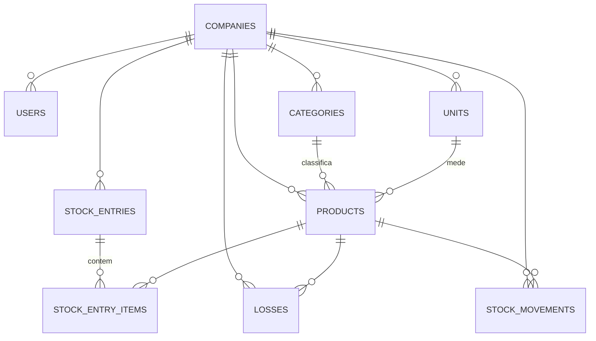

# Modelo de dados

PostgreSQL + [Drizzle ORM](https://orm.drizzle.team/). Schema em `apps/api/src/db/schema/`, um arquivo por tabela, agregado em `schema/index.ts` junto com as `relations`. Migrations geradas por `drizzle-kit` em `apps/api/src/db/migrations/`.

## Convenções usadas em (quase) toda tabela

- **`companyId` obrigatório** (`uuid` com FK para `companies.id`) — é o que garante o isolamento entre empresas-cliente (ver [decisões arquiteturais](./decisoes-arquiteturais.md)). Toda query de toda tabela de negócio filtra por esse campo.
- **Soft delete** via `deletedAt` (timestamp nulável) — nada é apagado de fato, exceto os poucos casos explicitamente documentados. Helper `timestamps` em `columns.ts` (`createdAt`, `updatedAt`, `deletedAt`).
- **Auditoria** via `createdBy`/`updatedBy` (`uuid`, sem FK — ver nota nas decisões arquiteturais sobre impersonação). Helper `auditBy` em `columns.ts`.
- Exceções às duas convenções acima: `companies` (é a raiz, não tem `companyId`), `stock_entry_items` e `stock_movements` (não têm `auditBy` completo — `stock_movements` só tem `createdBy`).

## Diagrama

## Tabelas

### `companies`
Raiz do multiempresa — cada linha é um cliente (frutaria/hortifrúti) contratante, exceto a linha especial `"Plataforma"` (ver decisões arquiteturais).

| Coluna | Tipo | Observação |
|---|---|---|
| `id` | uuid | PK |
| `name` | text | obrigatório |
| `document` | text | opcional, texto livre (CNPJ), sem validação de formato |
| `active` | boolean | default `true` — `false` = empresa suspensa, bloqueia login de todos os usuários dela |
| `createdAt`/`updatedAt`/`deletedAt` | timestamp | |

### `users`
| Coluna | Tipo | Observação |
|---|---|---|
| `id` | uuid | PK |
| `companyId` | uuid | FK `companies.id`, obrigatório |
| `name`, `email`, `passwordHash` | text | `email` é **único globalmente** (não escopado por empresa) |
| `role` | enum `user_role` | `admin` \| `gerente` \| `operador` \| `super_admin` |
| `active` | boolean | default `true` |
| `createdAt`/`updatedAt`/`deletedAt`, `createdBy`/`updatedBy` | | |

### `categories`
Classificação de produtos (ex: Frutas, Verduras). `id`, `companyId`, `name`, `description?`, timestamps, auditBy.

### `units`
Unidade de medida (ex: kg, un, dz). `id`, `companyId`, `name`, `abbreviation`, timestamps, auditBy.

### `products`
| Coluna | Tipo | Observação |
|---|---|---|
| `id` | uuid | PK |
| `companyId` | uuid | FK, obrigatório |
| `categoryId` | uuid | FK `categories.id`, obrigatório |
| `unitId` | uuid | FK `units.id`, obrigatório |
| `name` | text | único por empresa |
| `sku`, `barcode` | text | opcionais, `sku` único por empresa quando informado |
| `costPrice`, `salePrice` | numeric(12,2) | opcionais |
| `minStock` | numeric(12,3) | default `0` — limite pra alerta de "estoque baixo" |
| `currentStock` | numeric(12,3) | default `0` — **atualizado só pelos fluxos de entrada/perda**, nunca editado direto |
| `active` | boolean | default `true` |
| timestamps, auditBy | | |

`categoryId`/`unitId` são validados na criação/edição do produto para garantir que pertencem à mesma empresa (`assertCategoryAndUnitBelongToCompany`, em `products.service.ts`).

### `stock_entries` + `stock_entry_items`
Entrada de mercadoria (cabeçalho + itens), ver [fluxo de entrada](./fluxos-de-negocio.md#entrada-de-mercadoria).

- `stock_entries`: `id`, `companyId`, `supplierName?` (texto livre — **não existe entidade Fornecedor cadastrável**), `entryDate`, `notes?`, timestamps, auditBy.
- `stock_entry_items`: `id`, `stockEntryId` (FK), `productId` (FK), `quantity` numeric(12,3), `unitCost?` numeric(12,2), `createdAt`. Sem `companyId` próprio — o escopo por empresa vem sempre via join com `stockEntries.companyId`.

### `losses`
Registro de perda de estoque. `id`, `companyId`, `productId` (FK), `quantity` numeric(12,3), `reason` (enum `loss_reason`: `vencido` \| `avariado` \| `roubo_furto` \| `erro_operacional` \| `outro`), `notes?`, `lossDate`, timestamps, auditBy.

### `stock_movements`
Histórico append-only de toda variação de estoque — nunca é editado ou apagado, só inserido pelos fluxos de entrada/perda.

| Coluna | Tipo | Observação |
|---|---|---|
| `id` | uuid | PK |
| `companyId`, `productId` | uuid | FKs |
| `type` | enum `movement_type` | `entrada` \| `perda` \| `ajuste` (`ajuste` reservado, ver nota abaixo) |
| `quantity` | numeric(12,3) | positiva em entradas, **negativa** em perdas |
| `balanceAfter` | numeric(12,3) | saldo do produto após o movimento (snapshot, não recalculado) |
| `referenceType`, `referenceId` | text/uuid | aponta pra `stock_entry` ou `loss` que originou o movimento |
| `createdAt`, `createdBy` | | sem `updatedBy`/`deletedAt` — registro imutável |

**Nota:** o valor `ajuste` do enum existe e já é aceito como filtro em `GET /stock/movements`, mas nenhum fluxo do sistema cria movimentos desse tipo hoje — é espaço reservado para uma futura tela de "ajuste manual de estoque" (contagem/inventário), ainda não implementada.

## Enums (`apps/api/src/db/schema/enums.ts`)

- `user_role`: `admin`, `gerente`, `operador`, `super_admin`
- `movement_type`: `entrada`, `perda`, `ajuste`
- `loss_reason`: `vencido`, `avariado`, `roubo_furto`, `erro_operacional`, `outro`
